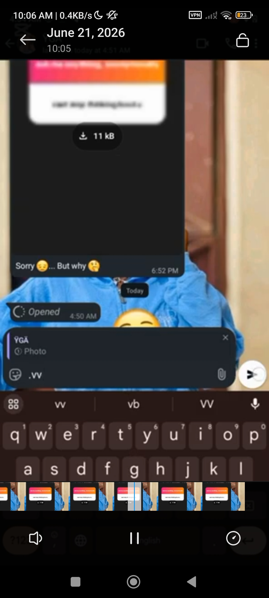

# Ephemeral Media Forensics Framework

## 📌 Project Overview
A JavaScript/Node.js-based prototype architecture demonstrating the security limitations of client-side transient data restrictions (like "View-Once" components in IM protocols). It proves that once binary assets hit the client-side volatile memory, they leave a trace regardless of UI-level display restrictions.

## 🛠️ Key Technical Features
* **Active Stream Interception:** Maps asynchronous event listeners to authorized application-layer WebSocket pipelines.
* **Context Isolation:** Monitors dynamic communication payloads to flag volatile media tags (`message_create`).
* **Memory Buffer Extraction:** Implements an on-demand trigger mechanism (`.vv` command parsing logic) to capture transient byte arrays before deletion flags fire.
* 

